  

  <a href="https://albertogarcialara.vercel.app">albertogarcialara.vercel.app</a>
  ·
  <a href="https://www.linkedin.com/in/alberto-garc%C3%ADa-lara-32b753253">LinkedIn</a>
  ·
  <a href="mailto:albertogrlara@gmail.com">albertogrlara@gmail.com</a>
  ·
  Granada, España, en remoto

## Qué hago

Ingeniero de software. Trabajo en **NTT Data** en Business Intelligence y, en paralelo, construyo y
mantengo **tres productos en producción con usuarios reales**. Llevo cada uno de punta a punta:
esquema de datos, backend, interfaz, despliegue y pruebas.

## En producción

- CRM clínico y **asistente de WhatsApp que agenda, cancela y reprograma turnos 24/7** en lenguaje
  natural, con la lógica de obras sociales argentinas. En producción desde julio de 2026 en un
  **hospital privado de Santa Fe** con un equipo de unos 15 sanitarios: recepción, médicos y
  pacientes lo usan a diario.
- **Retiré los tres agentes LLM tipo ReAct** al comprobar que inventaban datos y decían haber escalado
  a un humano sin hacerlo. Los sustituí por una **máquina de estados determinista**, con el modelo
  acotado a entender y a redactar.
- Aislamiento por clínica con **RLS multi-tenant**: 22 tablas con su identificador de cliente y más de
  20 procedimientos idempotentes, esquema versionado con migraciones y **una prueba de regresión en
  SQL por regla de negocio**.
- Next.js 16, React 19, TypeScript, Supabase y PostgreSQL, WhatsApp Cloud API, Gemini, Redis, Vercel.

- Producto **multi-cliente sobre una sola base** con aislamiento por RLS: siete pantallas de cliente,
  consola interna, siete tareas programadas de sincronización contra el CRM y alta de cliente
  automatizada. Responsable de producto.
- **Integración continua que levanta todas las migraciones en limpio** y las verifica contra un
  **doble de la API de GoHighLevel**, con un fichero de resultados esperados revisado a mano.
- Vite, React, Recharts, Supabase y PostgreSQL, API de GoHighLevel, Vercel.

- Aplicación de escritorio que **funciona íntegramente en el ordenador del despacho**, sin que ningún
  expediente salga de allí. El encargo no era anonimizar sin más: era que **ningún documento llegue a
  una IA sin salir anonimizado** o marcado como pendiente de revisar.
- **1.289 pruebas automáticas en verde** y paridad exacta verificada entre macOS y Windows. Activar
  OCR subió las detecciones un **147 %**, de 323 a 798, sobre el expediente real del cliente:
  **1.315 archivos** entre PDF nativo, escaneado y DOCX.
- Entregado empaquetado y en uso por el despacho. Los fallos que señala el cliente se diagnostican y
  se corrigen **sin llegar a ver los datos personales**.
- Python, PyMuPDF, spaCy, Tesseract OCR, customtkinter, PyInstaller, pytest.

## Una decisión de ingeniería

Tres agentes LLM tipo ReAct llevaban la conversación. Inventaban datos y decían haber escalado a un
humano sin hacerlo. Los retiré y puse una **máquina de estados determinista**: el modelo entiende el
mensaje y redacta la respuesta, pero el estado, la decisión y el dato salen de la base. El bot ya no
puede afirmar nada que no esté ahí, y cada regla de negocio tiene su prueba de regresión en SQL.

## Stack

**Lenguajes** TypeScript, JavaScript, SQL, Python, Java, C/C++ ·
**Frontend** Next.js, React, Vite, Tailwind CSS, Recharts ·
**Backend y datos** PostgreSQL, Supabase, Node.js, Redis, Snowflake, dbt ·
**IA** Google Gemini, OpenAI, spaCy, MCP ·
**Integraciones** n8n, GoHighLevel, WhatsApp Cloud API, Meta ·
**Infraestructura** Docker, Vercel, Cloudflare Pages, servidor Ubuntu propio, Git

## Experiencia

- **Software Engineer en NTT DATA**, indefinido y en remoto, desde julio de 2026. Business
  Intelligence: modelos analíticos en **Snowflake y dbt** y refactorización de procedimientos de
  procesamiento masivo, con pipelines de **millones de registros**.
- **Data Engineer, prácticas, en NTT DATA**, de febrero a junio de 2026.
- **Ingeniero de software freelance** desde abril de 2026: los tres productos de arriba. Además,
  reconstrucción del backend de métricas de un panel comercial (23 hallazgos documentados con
  evidencia reproducible sin red, y después esquema, vistas, procedimientos y sincronización nuevos) y
  automatización de cédulas catastrales de punta a punta, desde la solicitud hasta la entrega por
  SharePoint, OneDrive y correo.

## Formación y logros

- **Grado en Ingeniería Informática**, especialidad Ingeniería del Software. Universidad de Granada,
  2023 a 2026.
- Agentes de IA avanzados: MCP, WhatsApp y voz (Udemy, n8n), mayo de 2026. Formación en IA aplicada,
  autodidacta, desde febrero de 2026.
- **3.er puesto en el Hackathon de Telefónica**, como coordinador de equipo y responsable de la idea
  principal: definí el MVP y repartí el trabajo.
- Español nativo, inglés profesional.

## Contacto

Correo: [albertogrlara@gmail.com](mailto:albertogrlara@gmail.com) ·
[LinkedIn](https://www.linkedin.com/in/alberto-garc%C3%ADa-lara-32b753253) ·
[Portfolio](https://albertogarcialara.vercel.app)

El trabajo de cliente vive en repositorios privados. Lo que se puede abrir sin permisos es el
portfolio, y aquí está contado con sus cifras.

  <picture>
    <source media="(prefers-color-scheme: dark)" srcset="https://raw.githubusercontent.com/albertogxrcia/albertogxrcia/output/serpiente-oscura.svg">
    <source media="(prefers-color-scheme: light)" srcset="https://raw.githubusercontent.com/albertogxrcia/albertogxrcia/output/serpiente.svg">
    
  </picture>

La cabecera, las tarjetas y el diagrama son SVG generados por <code>tools/build-svg.mjs</code> a
partir de <code>data/perfil.json</code>. Sin CDN y sin servicios externos: se dibujan aquí y una acción
comprueba en cada push que siguen al día.
